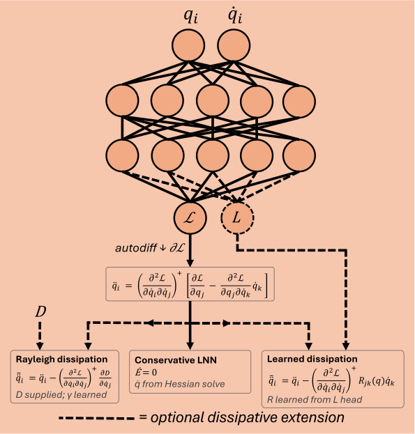

# HNNs vs LNNs vs PINNs

A JAX framework for comparing approaches to learning the dynamics of physical systems. The physics-informed neural network (PINN), Hamiltonian neural network (HNN) and Lagrangian neural network (LNN) each provide a systematic way of building the dynamics into a neural network, and a plain MLP serves as the control group. The goal is to quantify the advantages, disadvantages and tradeoffs of each, on the same systems, under the same evaluation.

| Method | Physics is... | Learns | Data |
|---|---|---|---|
| [MLP](docs/methods/mlp.md) | absent, pure data-driven baseline | `state → state_dot` or `t → state` | field or trajectory |
| [PINN](docs/methods/pinn.md) | a soft loss penalty | `t → state` | trajectory |
| [HNN](docs/methods/hnn.md) | a hard constraint on canonical coordinates `(q, p)` | `(q, p) → H` | field |
| [LNN](docs/methods/lnn.md) | a hard constraint on generalized coordinates `(q, q̇)` | `(q, q̇) → L` | field |

| HNN | LNN |
|:---:|:---:|
|  |  |

## Documentation

The full write-up lives in [`docs/`](docs/) and reads directly on GitHub:

- **[Overview](docs/index.md)** — the four methods, field vs trajectory data, and loss weighting
- **[Configuration reference](docs/configurations.md)** — every field on every config dataclass, what it does and what it defaults to
- **[Evaluation reference](docs/evaluation.md)** — what each benchmark column measures and how it is defined
- **Methods** — [MLP](docs/methods/mlp.md) · [PINN](docs/methods/pinn.md) · [HNN](docs/methods/hnn.md) · [LNN](docs/methods/lnn.md)
- **Systems** — [overview](docs/systems/index.md) · [Mass-Spring](docs/systems/mass_spring/index.md) · [Mass-Spring (Damped)](docs/systems/mass_spring_damped/index.md) · [Double Pendulum](docs/systems/double_pendulum/index.md) · [Double Pendulum (Damped)](docs/systems/double_pendulum_damped/index.md) · [Charged Particle](docs/systems/charged_particle/index.md)

The same pages build into a site with `mkdocs build`, where the rollout animations play inline.

## Systems

| System | Phase space | Canonical momentum | Energy | Ground truth | Extra methods |
|---|---|---|---|---|---|
| [Mass-Spring](docs/systems/mass_spring/index.md) | 2D $(q, p)$ | $p = \dot q$ | conserved | closed form | — |
| [Mass-Spring (Damped)](docs/systems/mass_spring_damped/index.md) | 2D $(q, p)$ | $p = \dot q$ | $\dot H = -\gamma p^2$ | closed form | port-Hamiltonian, learned dissipation |
| [Double Pendulum](docs/systems/double_pendulum/index.md) | 4D $(\theta, p)$ | $p = M(\theta)\dot\theta$ | conserved | Dopri5, tol $10^{-7}$ | — |
| [Double Pendulum (Damped)](docs/systems/double_pendulum_damped/index.md) | 4D $(\theta, p)$ | $p = M(\theta)\dot\theta$ | $\dot H = -\gamma\lVert\dot\theta\rVert^2$ | Dopri5, tol $10^{-7}$ | port-Hamiltonian, learned dissipation |
| [Charged Particle](docs/systems/charged_particle/index.md) | 4D $(r, p)$ | $p = mv + eA(r)$ | conserved | Dopri5, tol $10^{-7}$ | mechanical-coordinate HNN |

## Getting started

The project uses [uv](https://docs.astral.sh/uv/) and pins Python 3.10.

```bash
git clone https://github.com/MatthijsCDH/constrained-dynamics.git
cd constrained-dynamics
uv sync
```

The default dependency set includes `jax[cuda12]` and expects a CUDA-capable GPU.

Every entry point takes a system and a method, and `--list` shows what is available:

```bash
uv run python train.py --list
```

```
charged_particle: mlp, mlp_trajectory, hnn, hnn_mechanical, hnn_parametric, hnn_parametric_mechanical, lnn, lnn_parametric, pinn
double_pendulum: mlp, mlp_trajectory, hnn, hnn_parametric, lnn, lnn_parametric, pinn
double_pendulum_damped: mlp, mlp_trajectory, hnn, hnn_parametric, hnn_port_hamiltonian, lnn, lnn_parametric, lnn_learned_dissipation, pinn
mass_spring: mlp, mlp_trajectory, hnn, hnn_parametric, lnn, lnn_parametric, pinn
mass_spring_damped: mlp, mlp_trajectory, hnn, hnn_parametric, hnn_port_hamiltonian, lnn, lnn_parametric, lnn_learned_dissipation, pinn
```

### The three entry points

**`train.py`** trains one model once and shows it.

```bash
uv run python train.py mass_spring pinn --tuned
```

This run provides live loss curves and learned physics parameters when `LiveLearningConfig.enabled` is set to True, and generates an animation of the rollout against the ground truth when `VisualizationConfig.enabled` is set to True. Using `--tuned` loads hyperparameters previously found by `tune.py` instead of the defaults in the system's config file.

**`tune.py`** searches for hyperparameters by random search.

```bash
uv run python tune.py mass_spring pinn --n_trials 60 --n_seeds 5
```

Each trial samples a configuration from that system's search space and trains it on `--n_seeds` seeds, five by default. Each seed is scored by the [score](docs/evaluation.md#score), the rollout MSE as a fraction of the zero-predictor, clipped at 1. A seed whose validation loss shows it has collapsed to the trivial solution is stopped early and assigned 1 outright, and the trial's value is the mean over its seeds. Scoring across seeds is what makes the search prefer a configuration that works reliably over one that works when lucky.

**`benchmark.py`** produces the numbers in the results tables.

```bash
uv run python benchmark.py mass_spring hnn --n_seeds 50 --sigmas 0.0 0.05 0.1 0.2 0.5
```

For each noise level $\sigma$, the model is trained from scratch independently for each new seed. Retraining occurs at each new seed, as the goal is to evaluate how reliably a method converges to a good solution. Each trained model is rolled out and scored for MSE against ground truth, split into the part inside the data window and the part beyond it, along with energy drift, max horizon, max radius, inference time and training time. All results are stored per method from which the plots and tables are generated. What each of those numbers measures, and how it is aggregated across seeds, is documented in the [evaluation reference](docs/evaluation.md).

The intended order is `tune.py` first, then `benchmark.py`, as the tuned hyperparameters are automatically used within `benchmark.py`.

## Layout

```
configs/configurations.py     frozen dataclasses, the generic config schema
model/network.py              NeuralNetwork, the JAX training loop
model/physics_loss.py         PhysicsLoss ABC plus MLPLoss / HNNLoss / LNNLoss
systems/<name>/
  data.py                     ground-truth solver and training-data generation
  pinn.py                     the PINN residual for this system
  hnn.py, lnn.py              HamiltonianConfig / LagrangianConfig instances
  <name>_configurations.py    this system's presets and CONFIGS dict
  <name>_tune.py              search spaces for tune.py
  <name>_visualizations.py    live and post-hoc animations
docs/                         the write-up
```

All settings for a system live in one file, `systems/<name>/<name>_configurations.py`. Configurations are built from frozen dataclasses, so a run is changed by editing that file. Adding a new system means copying the folder shape; no edits to `train.py`, `configs/` or `model/` are needed.

## License

[MIT](LICENSE).
