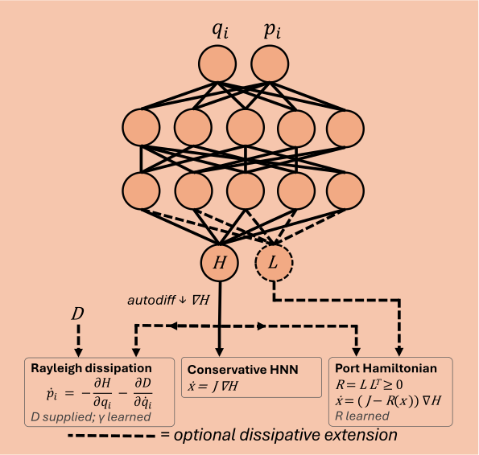

# HNN — Hamiltonian Neural Network

An HNN is trained on field data $x_{i} = (q_{i}, p_{i})$, where $q_{i}$ and $p_{i}$ denote the canonical coordinates and momenta of the system respectively, and outputs a single scalar corresponding to the Hamiltonian $H(q_{i}, p_{i})$. The equations of motion come out of $H$ via its symplectic gradient, $\dot q = \frac{\partial H}{\partial p}$ and $\dot p = -\frac{\partial H}{\partial q}$, computed with `jax.grad` rather than learned. 

Conservation of energy is an inherent property of the architecture, due to the antisymmetric structure of the symplectic gradient, 

$$
\dot H = \nabla H^\mathsf{T}J\nabla H = 0
$$

where $J^{T} = -J$. Moreover, because time does not explicitly enter the training, each phase-space sample is independent, eliminating the need for trajectory-based training and reducing computational cost. Time evolution only enters after training, by numerically integrating the learned dynamics. 

  

Canonical $(q_i, p_i)$ in, scalar $\mathcal{H}$ out. Hamilton's equations, $\dot q_i = \partial \mathcal{H}/\partial p_i$ and $\dot p_i = -\partial \mathcal{H}/\partial q_i$, are read off the network's own output by autodiff, not learned separately.

## Loss function

At each phase-space state, the network does not predict the time derivatives, but instead uses the symplectic gradient of the learned Hamiltonian,

$$
f_\theta(q, p) = \begin{pmatrix} \partial H_\theta / \partial p \\[2pt] -\,\partial H_\theta / \partial q \end{pmatrix}
$$

obtained from a `jax.grad` call on the scalar output. The predicted dynamics are then compared directly with the labeled derivatives using the mean square error,

$$
\mathcal{L}_{\text{eom}} = \frac{1}{N} \sum_{i=1}^{N} \bigl\lVert f_\theta(q_i, p_i) - \dot x_i \bigr\rVert^2 .
$$

This term is weighted by `HNNLossConfig.lambda_eom`. Together with an L2 regularization term $\mathcal{L}_{\text{reg}}$, this makes up the loss vector for a simple HNN. These loss functions are balanced by the Kendall uncertainty weighting, described in [Loss weighting](../index.md#loss-weighting). 

## Add-ons built for this project

### Hybrid known-term + network

The Hamiltonian $H$ can be split into a known functional form plus a network correction: $H = H_{\text{known}}(q,p;\theta) + H_{\text{net}}(q,p)$, where $\theta$ are learnable physics parameters and the known term is supplied per system through `HamiltonianConfig.known_term`. When `known_term` is `None` the Hamiltonian is the pure black-box network. The network only has to learn whatever the known term misses, and the physics parameters come out of training as an actual number, not just a fitted black box.

However, this procedure provides no mechanism to prevent $H_{\text{net}}(q,p)$ from absorbing the entire Hamiltonian, rendering $H_{\text{known}}(q,p;\theta)$ irrelevant. Consequently, the learnable parameter $\theta$ no longer has a unique solution, as many different $\theta$ can be paired with a compensating $H_{\text{net}}$ to reach the same minimal loss, leaving the loss landscape flat along $\theta$. Setting `HamiltonianConfig.penalize_correction` adds a term to the loss to break the degeneracy,

$$
\mathcal{L}_{\text{correction}} = \frac{1}{N} \sum_{i=1}^{N} H_{\text{net}}(q_i, p_i)^2
$$

This is a pure L2 penalty on the correction network's own output, weighted by `HNNLossConfig.lambda_correction`. Increasing $H_{\text{net}}$ to absorb more of the Hamiltonian now has a penalty, which pushes the optimizer toward solutions where $H_{\text{known}}(q,p;\theta)$ carries more of the dynamics and $H_{\text{net}}$ is used only to capture the remaining residual.

### Dissipative extensions

A standard HNN trained on damped data cannot represent systems with decaying energy, since $\dot{H}=0$ is an inherent property. Setting `HamiltonianConfig.dissipation` to `"rayleigh"` or `"port_hamiltonian"` instead of the default `"none"` offers two architectural changes that allow for dissipation, where the conservation guarantee is replaced by $\dot{H} \leq 0$. 

#### Rayleigh dissipation

To account for dissipation, the term $D(q, \dot q)$ is added to the momentum equation. The resulting equations of motion are,

$$
\dot q_i = \frac{\partial H}{\partial p_i}, \qquad
\dot p_i = -\frac{\partial H}{\partial q_i} - \frac{\partial D}{\partial \dot q_i}
$$

With this additional term, the rate of change of the Hamiltonian becomes,

$$
\dot H = -\sum_i \dot q_i \frac{\partial D}{\partial \dot q_i} \le 0
$$

The inequality is not an automatic guarantee, but must be enforced to ensure that the dissipative term only removes energy from the system. An example of a commonly used dissipation function is the quadratic form,

$$
D(q, \dot q) = \tfrac{1}{2}\gamma\,\dot q^{2}
\quad\Longrightarrow\quad
\dot H = -\gamma\,\dot q^{2} \le 0
$$

This form describes velocity-dependent damping, such as friction or air resistance. To satisfy the inequality the damping factor must be non-negative, $\gamma \ge 0$, which is enforced by bounding its learnable domain. Rayleigh is the dissipative counterpart of the hybrid known-term above and is supplied per system through `HamiltonianConfig.dissipation_term`, and only its constants are learnable, given by `LearnableParam` entries in `HNNLossConfig.physics`. That makes $\gamma$ come out of training as a physically meaningful number, at the cost of having to know the damping structure in advance.

#### Port-Hamiltonian

When the damping structure is not known, the whole dissipation operator can be learned instead. The dynamics are written in port-Hamiltonian form on the full state $x = (q, p)$,

$$
\dot x_i = \sum_{j=1}^{2n}\bigl(J_{ij} - R_{ij}(x)\bigr)\frac{\partial H}{\partial x_j}
$$

where $R$ is the correction matrix that contains the dissipation of the system. In contrast to Rayleigh, the correction matrix $R$ can couple different components of $\nabla H$ nonlinearly. The rate of change of the Hamiltonian becomes,

$$
\dot H = -\sum_{i,j=1}^{2n} R_{ij}\,\frac{\partial H}{\partial x_i}\,\frac{\partial H}{\partial x_j} \le 0
$$

where the inequality must be enforced rather than automatically guaranteed. To ensure this condition, the matrix $R$ must be symmetric positive semidefinite. However, since $R$ is learned by the network, it is not guaranteed that $R$ is positive semidefinite. To enforce positive semidefiniteness, the network instead learns a lower triangular matrix $L$, from which $R$ is constructed,

$$
R = L L^{\mathsf{T}}, \qquad L \ \text{lower triangular}
$$

This guarantees that $v^{\mathsf{T}} L L^{\mathsf{T}} v = \lVert L^{\mathsf{T}} v \rVert^2 \ge 0, \quad \forall v \in \mathbb{R}^n$. The matrix $L$ is read off a second slice of the same network's output at the same input $(q,p)$ where index $0$ is $H$ and the next $k(k+1)/2$ entries are the lower-triangular entries of $L$, where $k = 2n_{\text{dof}}$ and $n_{\text{dof}}$ is `HamiltonianConfig.n_dof`. 

#### Choosing between them

| | Rayleigh | Port-Hamiltonian |
|---|---|---|
| Damping form | supplied by the system | learned |
| Learned quantity | scalar constants | the $k(k+1)/2$ entries of a lower-triangular $L$, from which $R = LL^{\mathsf{T}}$ |
| Interpretability | high, $\gamma$ is a physical number | low, $R$ is a black box |
| Generality | modifies $\dot p$ only | acts on the full $\nabla H$, so it can dissipate through both equations and couple degrees of freedom |
| Network output width | $1$ | $1 + k(k+1)/2$ |

Port-Hamiltonian is strictly the more general of the two. Rayleigh is the better choice when the damping structure is actually known, because it recovers an interpretable parameter instead of a black box.

### Rollouts

Since the output of the neural network is the Hamiltonian of a system, the trajectory instead has to be obtained by integrating the symplectic gradient of the learned Hamiltonian. Moreover, the conservation of the energy is an exact statement about the learned Hamiltonian, but may fail for trajectories depending on the integrator. The integrator is selected by `HamiltonianConfig.integrator`.

#### RK4 (default)

With $f$ the learned field from `dynamics()` and step size $h$,

$$
\begin{aligned}
k_1 &= f(x_n), &\qquad k_2 &= f\!\left(x_n + \tfrac{h}{2}k_1\right), \\
k_3 &= f\!\left(x_n + \tfrac{h}{2}k_2\right), &\qquad k_4 &= f\!\left(x_n + h k_3\right),
\end{aligned}
$$

$$
x_{n+1} = x_n + \frac{h}{6}\left(k_1 + 2k_2 + 2k_3 + k_4\right)
$$

Fourth-order accurate, with local error $\mathcal{O}(h^5)$ and global error $\mathcal{O}(h^4)$. Although the local error is low, the rollout is not symplectic. The continuous flow of the learned $H$ conserves energy exactly, but RK4's discrete approximation of that flow does not, so measured energy drifts secularly over a long rollout. Any residual energy drift reported for an HNN under RK4 is therefore a property of the integrator, not evidence that the architecture failed to conserve.

#### Leapfrog (Störmer-Verlet)

Starting from an initial state $(q_{n}, p_{n})$, the leapfrog integrator advances the system by alternating half-step momentum updates with full-step position updates,

$$
\begin{aligned}
p_{n+1/2} &= p_n - \frac{h}{2}\,\frac{\partial H}{\partial q}(q_n,\, p_n) \\[2pt]
q_{n+1} &= q_n + h\,\frac{\partial H}{\partial p}(q_n,\, p_{n+1/2}) \\[2pt]
p_{n+1} &= p_{n+1/2} - \frac{h}{2}\,\frac{\partial H}{\partial q}(q_{n+1},\, p_{n+1/2})
\end{aligned}
$$

Only second-order accurate, so per-step it is worse than RK4, but it is symplectic. The practical consequence is that it conserves a nearby shadow Hamiltonian $\tilde H = H + \mathcal{O}(h^2)$ exactly, so its energy error stays bounded and oscillates around the true value instead of accumulating. Over long horizons that matters far more than the order of accuracy.

## Advantages

Since the conservation of energy is an inherent algebraic fact of the architecture, it holds even far outside the training distribution. This hard constraint supplies additional information to the model, but there is no free lunch: it requires the input to be given in canonical coordinates $(q,p)$ and training targets to be the corresponding phase-space derivatives. Since there are no collocation points and no physics to balance against the data loss, the tuning effort is low. Moreover, other conservation laws may be inserted either via a PINN-like soft constraint in the loss function, or strictly enforced by transforming the inputs. 

## Disadvantages

Any system must be expressible as a Hamiltonian in canonical coordinates, which in general may not be the case. Furthermore, the canonical coordinates and transformations must be known before training. For dissipative systems the Rayleigh or port-Hamiltonian extensions apply, but turn the conservation identity into a weaker guarantee with a learnable dissipative part.