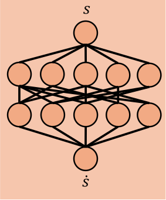
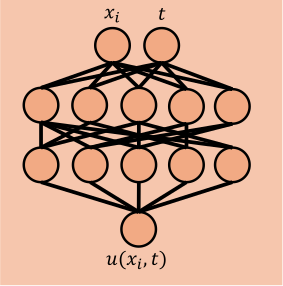

# MLP

This is a standard feedforward network with no physics inductive bias, which serves as a control group, providing a baseline for evaluating the benefits of incorporating the physical structure into a neural network. MLP runs in two modes depending on the data it's given, selected by `DataGenerationConfig.type`. In `"field"` mode, the network takes the state $s = (q,p)$ and outputs the time-derivative $ṡ = (q̇, ṗ)$, which is used to compute the trajectory through RK4 at rollout time. This method mirrors the HNN's and LNN's architectural shape, without the automatic differentiation structure. In `"trajectory"` mode, the network takes $(x_i, t)$ and outputs $u(x_i, t)$ directly, mirroring PINN's architecture minus the physics-residual loss. Both architectures are pictured below.

| Field mode | Trajectory mode |
|:---:|:---:|
|  |  |
| State `s` in, time-derivative `ṡ` out. | Time `t` (plus a spatial coordinate `x` for PDE-type systems) in, predicted state/field value `u(x, t)` out. |

## Loss function
The loss function is a single term, `loss_names = ("data",)`, weighted by `MLPLossConfig.lambda_data`:

$$
\mathcal{L}_{\text{data}} = \frac{1}{N} \sum_{i=1}^{N} \left( \hat{y}_i - y_i \right)^2
$$

where $N$ is the batch size and $\hat{y}$ is the network's output. This is the baseline loss function for all methods.

## Advantages and Disadvantages

MLP's advantage is that it makes no assumptions about the system, so it's the one method guaranteed to run on every system here, and it's what every other method's result gets measured against. It's also the cheapest to train, with no coordinate requirements, collocation points, or physics $\lambda$ values to tune.

The cost is that nothing constrains it beyond the data it's shown. Energy isn't conserved, even approximately, once a rollout drifts away from the training distribution. It also requires more data than HNN or LNN to reach comparable accuracy. 

In *trajectory* mode specifically, this shows up as a hard domain limit rather than a gradual one. The network only ever sees $t$ within the range covered by the trajectory data, so it has no basis for predicting anything past that range. 

