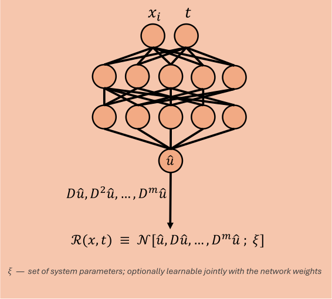

# PINN — Physics-Informed Neural Network

A PINN is trained on trajectory data $(t_i, u_i)$ and maps time directly to state, $u_\theta(t)$. Unlike the HNN and LNN it carries no architectural constraint, with the network being a standard MLP, and the physics enters entirely through the loss, as a residual of the governing equation evaluated wherever the solution is required to hold. That residual is what makes a PINN predict beyond the temporal domain covered by the dataset.

  

The derivatives the residual needs are taken with `jax.grad` on the network's own output, so the governing equation is checked exactly rather than approximated by finite differences.

## Loss function

The PINN's loss vector consists of four active loss functions each performing a different task, plus a boundary term that is reserved for PDE systems. 

**Data.** This loss term consists of an ordinary mean square error, where the learned trajectory is fit against the observations, on the normalized input $\hat t = t / t_{\max}$,

$$
\mathcal{L}_{\text{data}} = \frac{1}{N}\sum_{i=1}^{N}\bigl(u_\theta(t_i) - u_i\bigr)^2
$$

**Physics.** The physics loss term is a measure of how well the fitted data follows the governing differential equation $\mathcal{N}[u] = 0$. The residual is that operator applied to the network's own output,

$$
r(t) = \mathcal{N}\bigl[u_\theta\bigr](t)
$$

with every derivative it contains supplied by autodiff. It is evaluated at a fixed set of collocation points $\{\tau_j\}$, drawn once at construction over $[\,$`collocation.x_min`$,\,$`collocation.x_max`$\,]$ and independent of the data. 

$$
\mathcal{L}_{\text{physics}} = \frac{1}{M}\sum_{j=1}^{M} r(\tau_j)^2
$$

Collocation points allow the network to enforce the governing equations beyond the temporal domain covered by the data, enabling extrapolation to later times. Since these points do not require additional labeled data, extending the temporal domain does not add to the data cost, although the quality of the extrapolation still depends on the accuracy of the learned dynamics and the governing equations. Each system supplies its own $\mathcal{N}$ through `PINNLossConfig.residual_fn`. 

**Initial.** In general, the data and physics loss functions do not uniquely determine the solution of a dynamical system. To enforce the correct initial value, 

$$
\mathcal{L}_{\text{initial}} = \bigl\lVert \mathcal{I}\bigl[u_\theta\bigr] - u_{0} \bigr\rVert^2
$$

where $\mathcal{I}$ evaluates the network at $t=0$ and compares it with the prescribed initial state $u_0$. For more complicated initial values, the loss can include initial derivatives. 

**Boundary.** For problems with spatial boundaries, the solution must also satisfy the conditions of the spatial domain. These conditions are enforced by the boundary loss

$$
\mathcal{L}_{\text{boundary}} = \bigl\lVert \mathcal{B}\bigl[u_\theta\bigr] - b \bigr\rVert^2
$$

where $\mathcal{B}$ represents the boundary operator and $b$ denotes the prescribed boundary values. The operator $\mathcal{B}$ can take different forms depending on the problem, such as a Dirichlet condition specifying the solution itself or a Neumann condition specifying its normal derivative.

$$
\bigl(\mathcal{L}_{\text{data}},\ \mathcal{L}_{\text{physics}},\ \mathcal{L}_{\text{initial}},\ \mathcal{L}_{\text{boundary}},\ \mathcal{L}_{\text{reg}}\bigr)
$$

balanced by Kendall uncertainty weighting, described in [Loss weighting](../index.md#loss-weighting).

Since the PINN can contain up to five loss terms, balancing their relative contributions becomes increasingly difficult. The loss weights act analogously to Lagrange multipliers, controlling the strength with which each constraint is enforced. Consequently, the physical constraints are imposed softly through penalties rather than being satisfied exactly as hard constraints.

## Add-ons built for this project

### Learnable physics parameters

The constants appearing in $\mathcal{N}$ do not have to be known by the loss functions. Each is declared as a `LearnableParam(value, learnable)` inside `PINNLossConfig.physics` and lands in `params["physics"]`, so the optimizer recovers it from data alongside the network weights. Initial and boundary conditions can be declared the same way when they are unknown.

However, as the number of learnable parameters appearing in the physics residual increases, so does the space of parameter configurations that can satisfy the governing equations within the data domain, potentially leading to a non-unique solution. To constrain the learnable parameters to physically plausible ranges, each unconstrained parameter $\tilde{\theta}$ is mapped to a bounded interval using a sigmoid function,

$$
\theta = \theta_{\min} + (\theta_{\max} - \theta_{\min})\,\sigma(\tilde\theta)
$$

with the limits taken from `PINNLossConfig.bounds`, so a parameter cannot leave its range no matter what gradient it receives. Declaring a parameter with `learnable=False` keeps it in the same place but freezes it, which is equivalent to hardcoding the constant.

This is where a PINN earns its keep relative to a black-box model: the recovered constants are physically meaningful numbers, reported after training by `describe_physics` and checked against the truth in the results tables.

If a boundary or initial condition's target is itself learnable, the losses $\mathcal{L}_{\text{boundary}}$ and $\mathcal{L}_{\text{initial}}$ have free parameters on both sides, so the corresponding loss no longer uniquely sets the solution. Recovering the true conditions then requires the data loss to act as an additional source of information. 

### Causal weighting

A PINN during training has no incentive to optimize in a causal order, which can be problematic as errors at early times can propagate forward. Therefore, the network's prediction near the initial conditions must be weighted higher. This encourages the PINN to first establish a physically consistent solution at early times before using that solution as a basis for learning at later times. Causal weighting enforces the ordering by down-weighting a point according to how much residual is still unresolved before it,

$$
w_j = \exp\!\left(-\varepsilon \sum_{k<j} \bar r_k \right),
\qquad
\bar r_k = \frac{1}{|B_k|}\sum_{\tau \in B_k} r(\tau)^2
$$

The collocation points are sorted in time and grouped into `CollocationConfig.bins` equal-count bins $B_k$, so the sum runs over bin means rather than over individual points. This keeps $\varepsilon$ independent of how many collocation points a system happens to use, and averages within a bin instead of accumulating a noisy per-point random walk.

The $\varepsilon$, given by `PINNLossConfig.causal_epsilon`, controls the strength of the weighting and is held constant during training. No schedule is needed, because the mechanism anneals itself: early on the residuals are large, so the sum is large and every bin past the first is weighted near zero; as the residuals fall the weights relax towards one and the term becomes an ordinary unweighted residual. Setting $\varepsilon = 0$ disables the mechanism.

## Advantages

The network enforces the governing equations beyond the temporal data domain by minimizing the residual evaluated at a fixed set of collocation points. In contrast to an HNN and LNN, where the input requires labeled derivative states, a PINN only needs the state observed over time. Moreover, unknown physics parameters appearing in $\mathcal{N}$ are learnable. 

## Disadvantages

In contrast, the physics is only enforced through a soft penalty and so violations are minimized but not eliminated. Therefore, energy conservation is not exact, and the rollout may drift off the true energy surface. 

If every term of the residual contains $u$, the homogeneous equation can be satisfied at the trivial solution $u \equiv 0$ for any value of the learnable physics parameters in $\mathcal{N}$. Since the physics term never references the true trajectory, the trivial solution is a global minimum of it, and the physics parameters are unidentifiable there. This is what makes tuning the weights delicate, as the optimizer has no reason to favor one term at the expense of the others. Thus if the physics residual is driven faster to the trivial solution, then the data term must pull the solution out against an already minimized physics term, which can only be achieved if its weight is large enough. This makes tuning a PINN a difficult task.

Finally, the method is tied to knowing the governing equation, including which terms are present, whereas the HNN and LNN require only the existence of a Hamiltonian or a Lagrangian respectively.